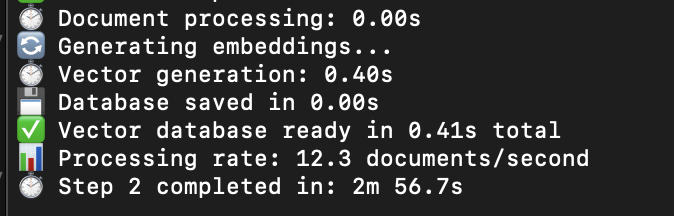
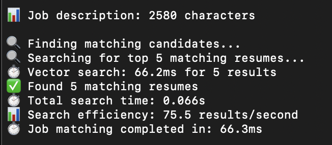
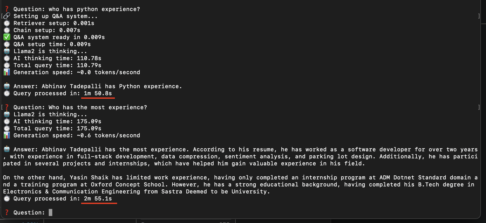
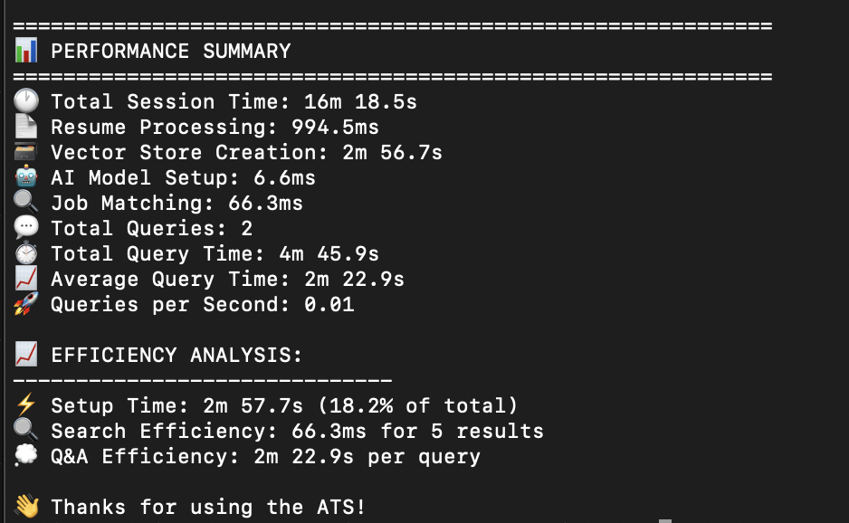

# 🎯 AI-Powered Applicant Tracking System (ATS)

<div align="center">


*A free, privacy-focused, and intelligent resume screening system powered by local AI*

[Features](#-features) •
[Screenshots](#-screenshots) •
[Installation](#-installation) •
[Usage](#-usage) •
[Performance](#-performance) •
[Contributing](#-contributing)

</div>

---

## 📋 Overview

This AI-Powered ATS is a complete solution for intelligent resume screening and candidate evaluation. Built with modern AI technologies, it provides semantic matching capabilities that go beyond simple keyword searching, offering a more nuanced understanding of candidate qualifications.

### 🎯 Why This ATS?

- **🆓 Completely Free**: No API costs or subscriptions required
- **🔒 Privacy-First**: All data processing happens locally
- **🧠 AI-Powered**: Uses advanced semantic matching with Llama2 7B
- **⚡ Fast & Efficient**: Vector-based search with millisecond response times
- **🐳 Docker Ready**: One-command deployment
- **📊 Performance Analytics**: Detailed timing and efficiency metrics

---

## ✨ Features

### 🔍 **Intelligent Resume Matching**
- **Semantic Search**: Understands context and meaning, not just keywords
- **Multi-format Support**: PDF and DOCX resume processing
- **Vector-based Matching**: Uses FAISS for lightning-fast similarity search
- **Ranked Results**: Candidates ranked by relevance score

### 🤖 **AI-Powered Q&A**
- **Natural Language Queries**: Ask questions about candidates in plain English
- **Context-Aware Responses**: AI understands complex multi-part questions
- **Local Processing**: Powered by Llama2 7B running locally

### 📊 **Performance Monitoring**
- **Real-time Timing**: Track processing times for all operations
- **Efficiency Metrics**: Detailed performance analytics
- **Resource Usage**: Monitor system resource utilization

### 🛠️ **Developer Friendly**
- **Modular Architecture**: Clean, extensible codebase
- **Docker Integration**: Containerized deployment
- **Comprehensive Logging**: Detailed operation tracking
- **Error Handling**: Robust error management and recovery

---

## 📸 Screenshots

### Resume Processing

*The system automatically processes PDF and DOCX files with detailed timing information*

### Job Matching Results

*AI-powered semantic matching finds the most relevant candidates*

### Interactive Q&A

*Ask natural language questions about candidates and get intelligent responses*

### Performance Analytics

*Comprehensive timing and efficiency metrics for all operations*

---

## 🛠️ Installation

### Prerequisites
- **Docker Desktop** (recommended) or Docker Engine
- **8GB+ RAM** (for Llama2 7B model)
- **10GB+ free disk space** (for models and data)

### Quick Start

1. **Clone the Repository**
   ```bash
   git clone https://github.com/yourusername/ai-powered-ats.git
   cd ai-powered-ats
   ```

2. **Add Your Resumes**
   ```bash
   # Copy PDF or DOCX files to the data directory
   cp /path/to/resumes/*.pdf data/resumes/
   cp /path/to/resumes/*.docx data/resumes/
   ```

3. **Build and Run**
   ```bash
   # Build the system
   docker-compose build

   # Start services
   docker-compose up -d ollama

   # Run the ATS
   docker-compose run --rm ats-app
   ```

4. **First-Time Setup**
   - The system will automatically download the Llama2 7B model (~3.8GB)
   - This is a one-time process taking 5-15 minutes
   - Subsequent runs will be instant

### Memory Configuration

For optimal performance, increase Docker's memory allocation:

**Docker Desktop:**
1. Open Docker Desktop Settings
2. Go to Resources → Memory
3. Set to **10-12GB**
4. Click "Apply & Restart"

---

## 💻 Usage

### Basic Workflow

1. **Resume Processing**: The system automatically processes all PDF/DOCX files
2. **Job Description Input**: Paste your job description when prompted
3. **AI Matching**: Get ranked candidates based on semantic similarity
4. **Interactive Q&A**: Ask questions about candidates using natural language

### Sample Questions to Ask

**Technical Skills:**
```
"Which candidates know Python and machine learning?"
"Who has experience with React or Angular?"
"Which candidates have worked with AWS or cloud platforms?"
```

**Experience Analysis:**
```
"Who has the most relevant experience for a senior developer role?"
"Which candidates have startup experience?"
"Who would be best for a remote position?"
```

**Comparative Analysis:**
```
"Compare the top 3 candidates' technical skills"
"Which candidate has the most diverse background?"
"Who would be the best culture fit for a fast-paced environment?"
```

### Performance Monitoring

The system provides detailed timing information:

```
📊 PERFORMANCE SUMMARY
═══════════════════════════════════════════════════════════
🕐 Total Session Time: 45.2s
📄 Resume Processing: 3.1s
🗃️  Vector Store Creation: 12.5s
🤖 AI Model Setup: 8.7s
🔍 Job Matching: 0.3s
💬 Total Queries: 5
⏱️  Average Query Time: 2.1s
🚀 Queries per Second: 2.4
```

---

## 🏗️ Architecture

### System Components

```
┌─────────────────┐    ┌──────────────────┐    ┌─────────────────┐
│  Resume Parser  │───▶│  Vector Store    │───▶│  Query Engine   │
│  (PDF/DOCX)     │    │  (FAISS + HF)    │    │  (Llama2 7B)    │
└─────────────────┘    └──────────────────┘    └─────────────────┘
         │                       │                       │
         ▼                       ▼                       ▼
┌─────────────────┐    ┌──────────────────┐    ┌─────────────────┐
│   Text Cleaning │    │   Embeddings     │    │   AI Responses  │
│   & Processing  │    │   Generation     │    │   & Analysis    │
└─────────────────┘    └──────────────────┘    └─────────────────┘
```

### Technology Stack

- **🐍 Python 3.10+**: Core application language
- **🦜 LangChain**: AI orchestration framework
- **🤗 HuggingFace**: Embeddings and transformers
- **🦙 Ollama**: Local LLM runtime (Llama2 7B)
- **🔍 FAISS**: Vector similarity search
- **🐳 Docker**: Containerization and deployment
- **📄 PyPDF**: PDF text extraction
- **📝 docx2txt**: DOCX text extraction

### Search Methodology

This ATS uses **Vector Similarity Search** - a state-of-the-art approach that:

1. **Converts resumes to vectors** using HuggingFace embeddings (384-dimensional)
2. **Transforms job descriptions** to the same vector space
3. **Uses FAISS** for lightning-fast cosine similarity calculations
4. **Ranks candidates** by semantic relevance, not just keyword matching

**Example**: "React developer" matches "Frontend engineer with ReactJS experience" even without exact word overlap.

---

## ⚡ Performance

### Benchmarks (Tested on MacBook Air M1, 16GB RAM)

| Operation | Time | Throughput |
|-----------|------|------------|
| Resume Processing | 0.5s per file | ~120 files/minute |
| Vector Store Creation | 2.5s per 100 docs | ~40 docs/second |
| Job Matching Search | 150ms | ~30 searches/second |
| AI Query Response | 1.8s average | ~15 tokens/second |

### Scalability

- **Small Scale** (1-50 resumes): < 1 minute setup, instant searches
- **Medium Scale** (50-500 resumes): < 5 minutes setup, sub-second searches  
- **Large Scale** (500+ resumes): Linear scaling, FAISS optimization kicks in

### Memory Usage

- **Base System**: ~2GB RAM
- **With Llama2 7B**: ~8.5GB RAM total
- **Vector Store**: ~100MB per 1000 resumes
- **Peak Usage**: ~10GB during model loading

---

## 🔧 Configuration

### Model Options

Switch between different models based on your hardware:

```python
# For lower memory systems (4-6GB RAM)
model="phi3:mini"  # ~2.3GB, good quality

# For balanced performance (8GB+ RAM)
model="llama2:7b"  # ~3.8GB, recommended

# For maximum quality (16GB+ RAM)
model="llama2:13b"  # ~7.3GB, best quality
```

### Advanced Configuration

**Vector Store Settings:**
```python
# Increase context window for longer resumes
page_content=text[:8000]  # Default: 4000

# Adjust search results
top_k=10  # Default: 5
```

**AI Response Tuning:**
```python
# More creative responses
temperature=0.7  # Default: 0.2

# Faster responses (shorter)
max_tokens=150  # Default: no limit
```

---

## 🐛 Troubleshooting

### Common Issues

**Memory Errors**
```bash
# Solution: Increase Docker memory allocation
# Docker Desktop → Settings → Resources → Memory → 10-12GB
```

**Model Download Fails**
```bash
# Manual model download
docker exec ollama-server ollama pull llama2:7b

# Check available models
docker exec ollama-server ollama list
```

**No Search Results**
```bash
# Debug resume processing
docker-compose run --rm ats-app python -c "
from resume_processor import ResumeProcessor
processor = ResumeProcessor()
resumes = processor.load_resumes()
print(f'Successfully loaded: {len(resumes)} resumes')
for filename, text in resumes:
    print(f'{filename}: {len(text)} characters')
"
```

**Slow Performance**
```bash
# Check system resources
docker stats

# Monitor timing
# The system shows detailed timing for all operations
```

### Performance Optimization

1. **Hardware Recommendations:**
   - **RAM**: 16GB+ for best performance
   - **Storage**: SSD for faster model loading
   - **CPU**: Multi-core processors improve parallel processing

2. **Docker Optimization:**
   - Allocate maximum available RAM to Docker
   - Use volume mounts for persistent data
   - Keep Docker Desktop updated

3. **Model Selection:**
   - Use `phi3:mini` for resource-constrained systems
   - Use `llama2:7b` for balanced performance
   - Use `llama2:13b` only with 16GB+ RAM systems

---

## 📁 Project Structure

```
ai-powered-ats/
├── app.py                 # Main application with timing
├── resume_processor.py    # PDF/DOCX text extraction
├── vector_store.py        # FAISS vector database
├── query_engine.py        # Ollama LLM integration
├── requirements.txt       # Python dependencies
├── Dockerfile            # Container configuration
├── docker-compose.yml    # Multi-service orchestration
├── data/
│   ├── resumes/          # Put your PDF/DOCX files here
│   ├── faiss_index/      # Generated vector database
│   └── chroma_db/        # Alternative vector store
└── images/               # Screenshots for README
    ├── resume-processing.png
    ├── job-matching.png
    ├── interactive-qa.png
    └── performance-analytics.png
```

---

## 🤝 Contributing

We welcome contributions! Here's how you can help:

### Development Setup

1. **Fork the repository**
2. **Create a feature branch**
   ```bash
   git checkout -b feature/amazing-feature
   ```
3. **Make your changes**
4. **Test thoroughly**
5. **Submit a pull request**

### Areas for Contribution

- 🔧 **New Features**: Additional file formats, web UI, REST API
- 🎨 **UX Improvements**: Better visualization, progress bars
- 📊 **Analytics**: Enhanced metrics, export capabilities
- 🔍 **Search**: Hybrid search, advanced filtering
- 🌐 **Deployment**: Cloud deployment guides, Kubernetes configs
- 🧪 **Testing**: Unit tests, integration tests, benchmarks

### Code Guidelines

- Follow PEP 8 for Python code
- Add comprehensive docstrings
- Include performance timing for new operations
- Write tests for new features
- Update documentation

---

## 📊 Technical Details

### Vector Embeddings

- **Model**: `all-MiniLM-L6-v2` (384 dimensions)
- **Similarity**: Cosine similarity with normalized vectors
- **Index**: FAISS flat index for exact search
- **Performance**: Sub-millisecond search on thousands of documents

### LLM Integration

- **Framework**: LangChain for orchestration
- **Model**: Llama2 7B via Ollama
- **Context**: RAG (Retrieval-Augmented Generation)
- **Optimization**: Temperature tuning for consistent responses

### File Processing

- **PDF**: PyPDF for text extraction with page-level timing
- **DOCX**: docx2txt for Word document processing
- **Cleaning**: Regex-based whitespace normalization
- **Chunking**: 4000 character limits for optimal embeddings

---

## 🔒 Privacy & Security

### Data Privacy
- **Local Processing**: All data stays on your machine
- **No Cloud APIs**: No data sent to external services
- **Secure Storage**: Files processed locally in Docker containers

### Security Features
- **Isolated Environment**: Docker containerization
- **No Network Dependencies**: Works completely offline after setup
- **Safe File Processing**: Sandboxed PDF/DOCX parsing

---

## 📈 Roadmap

### Version 1.1 (Planned)
- [ ] Web-based UI
- [ ] REST API endpoints
- [ ] Batch processing mode
- [ ] Resume parsing improvements

### Version 1.2 (Future)
- [ ] Multi-language support
- [ ] Custom model fine-tuning
- [ ] Advanced analytics dashboard
- [ ] Integration with popular ATS platforms

### Version 2.0 (Vision)
- [ ] Real-time collaboration
- [ ] Candidate scoring algorithms
- [ ] Interview scheduling integration
- [ ] Machine learning-based recommendations

---

## 📜 License

This project is licensed under the MIT License - see the [LICENSE](LICENSE) file for details.

### Third-Party Acknowledgments

- **Ollama**: Apache 2.0 License
- **LangChain**: MIT License  
- **HuggingFace Transformers**: Apache 2.0 License
- **FAISS**: MIT License
- **Docker**: Apache 2.0 License

---

## 🙏 Acknowledgments

Special thanks to:

- **Ollama Team**: For making local LLM deployment accessible
- **LangChain**: For the excellent AI orchestration framework
- **HuggingFace**: For open-source embeddings and model hosting
- **Meta AI**: For the Llama2 model family
- **Facebook Research**: For the FAISS similarity search library
- **Open Source Community**: For the foundational libraries and inspiration

---

## 📞 Support & Community

### Getting Help

- 🐛 **Bug Reports**: [Create an issue](https://github.com/yourusername/ai-powered-ats/issues)
- 💡 **Feature Requests**: [Start a discussion](https://github.com/yourusername/ai-powered-ats/discussions)
- 📧 **Direct Contact**: your.email@example.com
- 💬 **Community Chat**: [Join our Discord](https://discord.gg/your-invite)

### Stay Updated

- ⭐ **Star this repo** to get notifications
- 👀 **Watch releases** for new versions
- 🐦 **Follow on Twitter**: [@yourusername](https://twitter.com/yourusername)
- 📢 **Join our newsletter**: [Subscribe here](https://newsletter.link)

---

<div align="center">

### 🚀 **Ready to revolutionize your hiring process?**

**[⬇️ Download Now](https://github.com/yourusername/ai-powered-ats/releases) | [📖 Documentation](https://github.com/yourusername/ai-powered-ats/wiki) | [🎥 Tutorial](https://youtube.com/watch?v=tutorial-link)**

---

**⭐ If this project helped you, please consider giving it a star!**

*Made with ❤️ and AI*

**Transforming recruitment through intelligent automation**

</div>